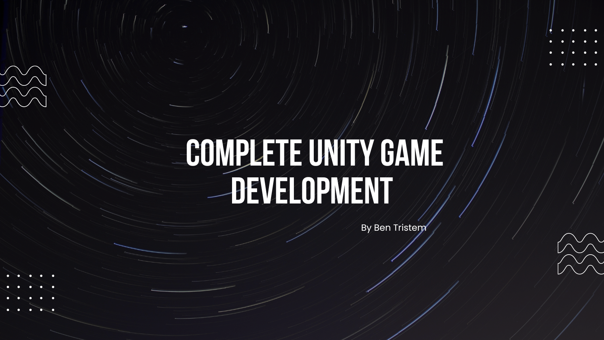
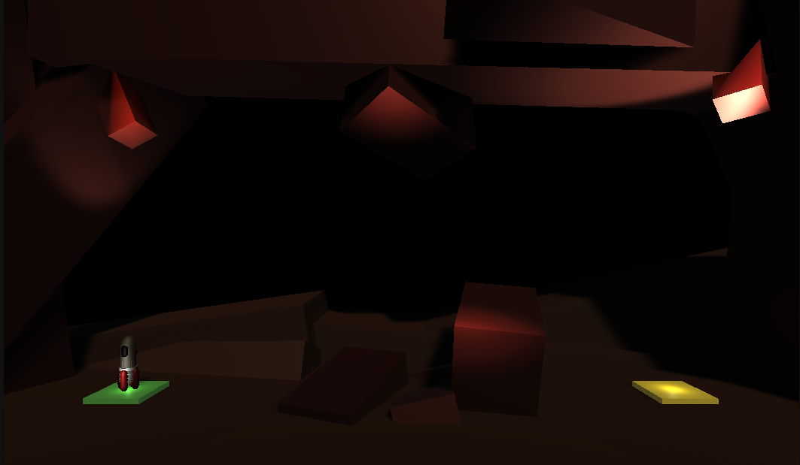
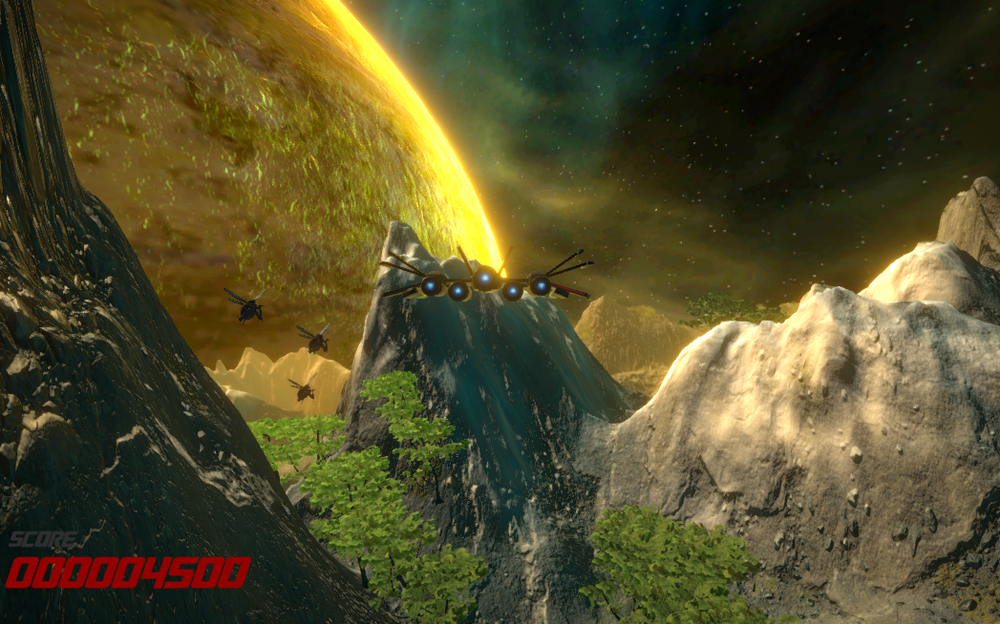

# 2023UnityGameDevCourse

## Section 1: Introduction

#### 1.1 About

The Complete Unity Game Development Course 2023 on Udemy is a course for aspiring game developers. This course is taught by Ben Tristem, founder of GameDev.tv. Learn more about the course [here](https://www.gamedev.tv/).

#### 1.2 Skills Learned

Through this course, I've learned the basics of game development with Unity, this includes:

- C# scripting
- Timeline
- Terrain creation
- UI
- Collision handling
- Post-processing
- Particle system

---

### Section 2: Projects

Throughout this course, I've created many projects which will be showcased below.

#### 2.1 Project Boost

This game is a simple obstacle course type of game with the main intention to get familiar with Unity's Rigidbody and Particle system.

Check out the github repo for this game [here](https://github.com/oscarqjh/unity-rocket-game-2023).

#### 2.2 Argon Assault

This game is a simple rail shooter game where I got to work with terrain creation and timelines.

Check out the github repo for this game [here](https://github.com/oscarqjh/unity-argon-assault-2023)

---

### Acknowledgment

- Ben Tristem for his comprehensive Unity Game Development course, which served as the foundation for all the projects found here.
